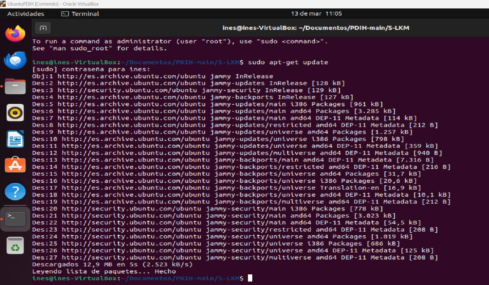

# Seminario. Módulos cargables del kernel (LKM)
## Cuestiones a resolver 

El objetivo principal es conocer cómo funciona el sistema de módulos cargables del kernel de Linux y hacer un módulo sencillo. 

El estudiante debe estudiar el sistema de LKM de Linux. A continuación desarrollará un módulo sencillo en lenguaje C y lo cargará en el kernel usando las herramientas 
estudiadas. Comprobará su correcto funcionamiento inspeccionando los logs del sistema y finalmente descargará el módulo. 

Como resultado se mostrará al profesor el funcionamiento correcto del LKM desarrollado así como el proceso de carga en el kernel. 

**En el documento a entregar se describirá cómo se ha creado y cargado el módulo, y se incluirán varias capturas de pantalla mostrando el proceso y el resultado.**

## Resolución
### Preparación del sistema para construir LKMs
Uso una máquina virtual con Ubuntu 22.

$sudo apt-get update$

$sudo apt-cache search linux-headers-$(uname -r)$

$sudo apt-get install linux-headers-$(uname -r)$

